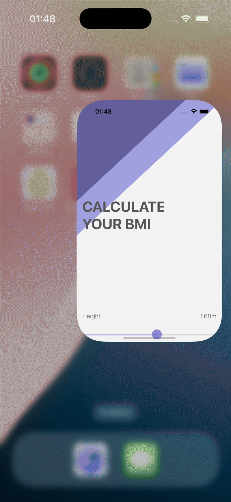

# 🧮 BMI Calculator

A beautifully simple iOS app that calculates Body Mass Index (BMI) based on the user’s weight and height, then provides friendly feedback on whether you should eat more pies or less pies 🍰.  
Built in **Swift** using the **MVC design pattern**.

---

## 🎥 Demo

  

---

## ✨ Features
- Clean and intuitive UI  
- Enter weight and height → instantly get BMI  
- Multi-screen navigation with smooth transitions  
- Color feedback to indicate health ranges  

---

## 🧑‍💻 What I Learned
- Building **multi-screen apps** with UIKit  
- Using **Optionals** (binding, chaining, nil coalescing)  
- Difference between **Classes vs Structs**  
- **Pass by value** vs **pass by reference**  
- Formatting strings and working with **color literals**  

---

## 🚀 Tech
- Swift  
- UIKit  
- MVC Architecture   
