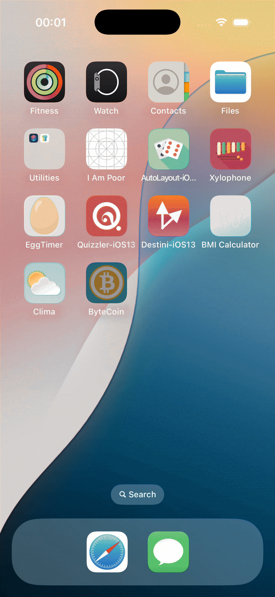

# 💰 Bitcoin Price Tracker

A simple iOS app that fetches the **current Bitcoin price** in multiple currencies using the [CoinAPI](https://www.coinapi.io/) service.  
Built in **Swift** following the **MVC design pattern**.

---

## 🎥 Demo

  

---

## ✨ Features
- Select your currency and instantly see the latest BTC price 💵  
- Clean, minimal UI  
- Asynchronous API calls with `URLSession`  
- Error handling for network issues  

---

## 🧑‍💻 What I Learned
- Making **network requests** with `URLSession`  
- Parsing **JSON data** with `Codable`  
- Using the **delegate pattern** to pass data from the model to the controller  
- Updating the **UI on the main thread**  
- Integrating and handling a **3rd party API**  

---

## 🚀 Tech
- Swift  
- UIKit  
- CoinAPI (for BTC price data)  
- MVC Architecture  
