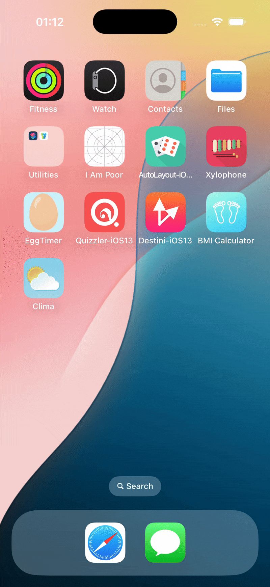

# 🌤️ Weather App

A simple yet stylish iOS app that shows real-time weather for any city you search 🌍.  
Built in **Swift** with **UIKit** and the **MVC design pattern**.

---

## 🎥 Demo

  

---

## ✨ Features
- Search any city to get live weather data  
- Displays temperature, condition, and matching weather icon ☀️🌧️❄️  
- Smooth text input with keyboard handling  
- Clean UI with dynamic backgrounds  

---

## 🧑‍💻 What I Learned
- Fetching data from a **REST API** using `URLSession`  
- Parsing **JSON** with `Codable`  
- Using **delegates & protocols** for text input  
- Safe **Optionals handling**  
- Updating the **UI on the main thread** after async calls  

---

## 🚀 Tech
- Swift  
- UIKit  
- OpenWeatherMap API  
- MVC Architecture  
