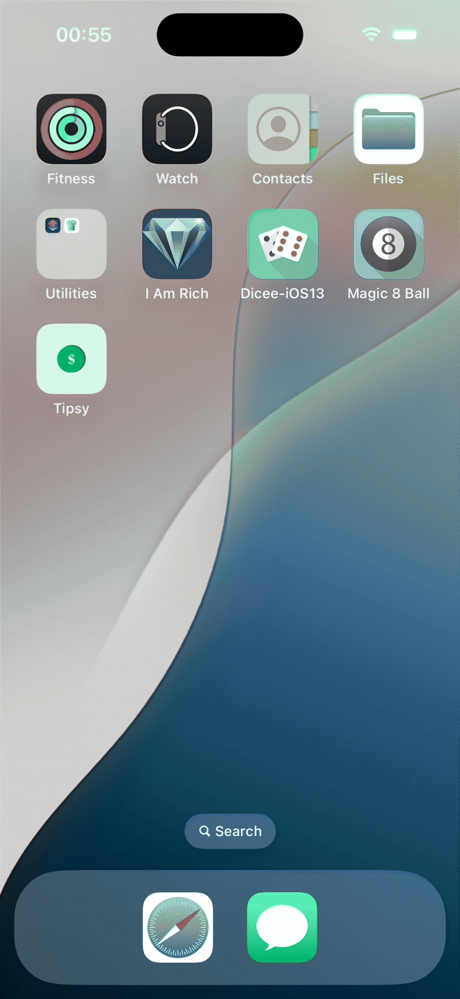

# 💸 Tip Splitter App  

A simple iOS app that helps you **split a bill** between multiple people while adding a tip.  
Just enter the total amount, select a tip %, choose the number of people, and instantly see how much each person should pay.  

---

## 🎥 Demo  

  

---

## ✨ Features  
- Enter bill total quickly  
- Choose tip percentage (0%, 10%, 20%)  
- Adjust split between people with a stepper  
- Instant calculation of amount per person  
- Clean UI following **MVC design pattern**  
